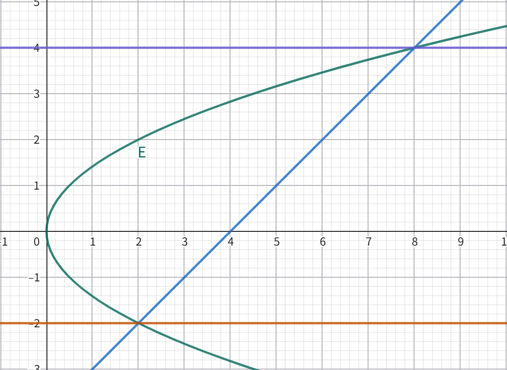
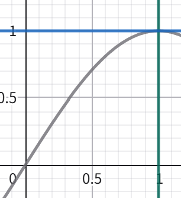
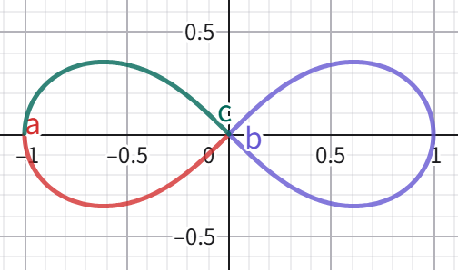
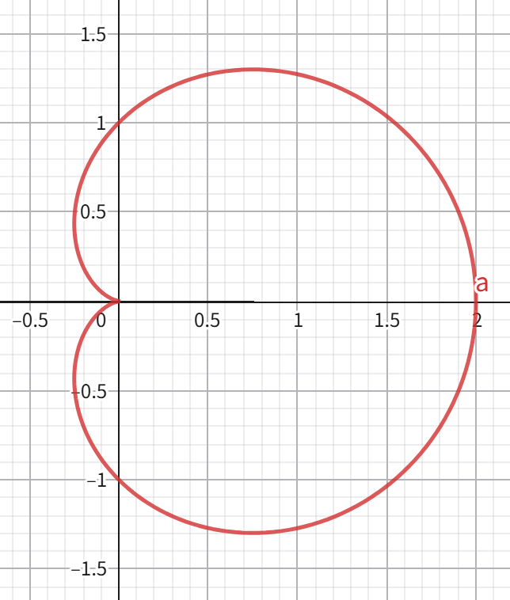

# 第十九讲 定积分的计算与应用

### 将序列极限转化为 Riemann 积分

[例 1] 求 $\displaystyle\lim_{n \to +\infty} \sum_{k = 1}^n \frac{1}{n + k}$。

注意到 $\dfrac{1}{n + k} = \dfrac{1}{1 + \frac{k}{n}} \cdot \dfrac{1}{n}$，考虑将求和转化为 Riemann 和：

- 令 $f(x) = \dfrac{1}{1 + x}$。
- 取分割 $P : \dfrac{0}{n}, \dfrac{1}{n}, \cdots, \dfrac{n}{n}$，$\xi = (\dfrac{1}{n}, \cdots, \dfrac{n}{n})$。
- 则 $\displaystyle\sum_{k = 1}^n \frac{1}{n + k} = \sum_{k = 1}^n f(\xi_i) \Delta x_i$，且 $|P| = \dfrac{1}{n}$。

由于 $\displaystyle\lim_{n \to +\infty} |P| = 0$，Riemann 和收敛于 Riemann 积分，故 $\displaystyle\lim_{n \to +\infty} \sum_{k = 1}^n \frac{1}{n + k} = \int_0^1 \frac{1}{1 + x} \text{d} x = \ln 2$。

[例 2] 求 $\displaystyle\lim_{n \to +\infty} \sum_{k = 1}^n \frac{n}{n^2 + k^2}$。

$$
\begin{aligned}
\lim_{n \to +\infty} \sum_{k = 1}^n \frac{n}{n^2 + k^2} &= \lim_{n \to +\infty} \sum_{k = 1}^n \frac{1}{1 + (\frac{k}{n})^2} \cdot \frac{1}{n} \\
&= \int_0^1 \frac{1}{1 + x^2} \text{d} x \\
&= \arctan 1
\end{aligned}
$$

[例 3] 当 $p \geq 0$，求 $\displaystyle\lim_{n \to +\infty} \sum_{k = 1}^n \frac{k^p}{n^{p + 1}}$。

当 $p = 0$，答案显然为 $1$；下面讨论 $p > 0$ 的情况。

$$
\begin{aligned}
\lim_{n \to +\infty} \sum_{k = 1}^n \frac{k^p}{n^{p + 1}} &= \lim_{n \to +\infty} \sum_{k = 1}^n (\frac{k}{n})^p \cdot \frac{1}{n} \\
&= \int_0^1 x^p \text{d} x \\
&= \frac{1}{p + 1}
\end{aligned}
$$

### 定积分的计算

- _其实就是把不定积分的那一坨搬过来了（_

#### 定义：连续可微

称 $f$ 在 $(a, b)$ 上连续可微（记作 $f \in C^1(a, b)$），若 $f$ 在 $(a, b)$ 上可导，且 $f' \in C(a, b)$。

称 $f$ 在 $[a, b]$ 上连续可微（记作 $f \in C^1 [a, b]$），若 $f$ 在 $(a, b)$ 上可导、在 $a$ 处右侧可导、在 $b$ 处左侧可导，且 $f' \in C[a, b]$。

#### 换元法

条件：

- (1) $f \in C[a, b], \varphi \in C^1 [\alpha, \beta]$。
- (2) $\varphi(\alpha) = a, \varphi(\beta) = b, \varphi([\alpha, \beta]) \subset [a, b]$。

结论：$\displaystyle\int_a^b f(x) \text{d} x = \int_{\alpha}^{\beta} f(\varphi(t)) \varphi'(t) \text{d} t$。

- **注意：这里不要求 $\varphi$ 在 $[\alpha, \beta]$ 上有反函数！**

证明：

- 取 $f$ 在 $[a, b]$ 上的一个原函数为 $F$，则：

$$
\begin{aligned}
\int_a^b f(x) \text{d} x &= F(b) - F(a) \\
&= F(\varphi(\beta)) - F(\varphi(\alpha)) \\
&= \int_{\alpha}^{\beta} (F \circ \varphi)'(t) \text{d} t \\
&= \int_{\alpha}^{\beta} f(\varphi(t)) \varphi'(t) \text{d} t
\end{aligned}
$$

[例 4] 求 $\displaystyle\int_0^1 \sqrt{1 - x^2} \text{d} x$。

换元 $x = \sin t \ (t \in [0, \dfrac{\pi}{2}])$，则：

$$
\begin{aligned}
\int_0^1 \sqrt{1 - x^2} \text{d} x &= \int_0^{\frac{\pi}{2}} \cos t \text{d} (\sin t) \\
&= \int_0^{\frac{\pi}{2}} \cos^2 t \text{d} t \\
&= \frac{1}{2} \int_0^{\frac{\pi}{2}} (1 + \cos 2t) \text{d} t) \\
&= \frac{1}{2} \left. (t + \frac{\sin (2t)}{2}) \right|_0^{\frac{\pi}{2}} \\
&= \frac{\pi}{4}
\end{aligned}
$$

#### 分部积分法

条件：$u, v \in C^1 [a, b]$。

结论：$\displaystyle\int_a^b u(x) v'(x) \text{d} x = \left. (u(x) v(x)) \right|_a^b - \int_a^b u'(x) v(x) \text{d} x$。

证明：由不定积分的分部积分公式立即可得。

[例 5] 求 $\displaystyle\int_0^{\pi} x \sin x \text{d} x$。

$$
\begin{aligned}
\int_0^{\pi} x \sin x \text{d} x &= -\int_0^{\pi} x \text{d} (\cos x) \\
&= -(\left. (x \cos x) \right|_0^{\pi} - \int_0^{\pi} \cos x \text{d} x) \\
&= \pi + \left. \sin x \right|_0^{\pi} \\
&= \pi
\end{aligned}
$$

#### 带积分余项与 Cauchy 余项的 Taylor 公式

##### 引理（$[0, 1]$ 上的情况）

条件：$f \in C^{n + 1} [0, 1]$。

结论：$f(1) = \displaystyle\sum_{i = 0}^n \frac{f^{(i)}(0)}{i!} + \frac{1}{n!} \int_0^1 f^{(n + 1)}(t) (1 - t)^n \text{d} t$。

证明：

- 考虑数学归纳法：
- (1) 当 $n = 0$，由 Newton-Leibnitz 公式可知 $f(1) - f(0) = \displaystyle\int_0^1 f'(t) \text{d} t$，结论成立。
- (2) 若结论对 $n = k$ 成立，欲证其对 $n = k + 1$ 也成立。
- _Motivation：我要造出更高阶的导数。_
- 考虑用**分部积分法**改写后面那一项：

$$
\begin{aligned}
\frac{1}{k!} \int_0^1 f^{(k + 1)}(t) (1 - t)^k \text{d} t &= -\frac{1}{(k + 1)!} \int_0^1 f^{(k + 1)}(t) \text{d} ((1 - t)^{k + 1}) \\
&= -\frac{1}{(k + 1)!} (\left. (f^{k + 1} (t) (1 - t)^{k + 1}) \right|_0^1 - \int_0^1 (1 - t)^{k + 1} \text{d} (f^{k + 1}(t)) \\
&= \frac{1}{(k + 1)!} (f^{k + 1}(0) - \int_0^1 f^{(k + 2)}(t) (1 - t)^{k + 1} \text{d} t)
\end{aligned}
$$

- 代入 $n = k$ 的结论即得：

$$
f(1) = \displaystyle\sum_{i = 0}^{k + 1} \frac{f^{(i)}(0)}{i!} + \frac{1}{(k + 1)!} \int_0^1 f^{(k + 2)}(t) (1 - t)^{k + 1} \text{d} t
$$

##### 定理（一般情况）

条件：

- (1) $f \in C^{n + 1} (I)$。
- (2) $a, x \in I \land a \neq x$。

结论：

- (1) 积分余项：$f(x) = \displaystyle\sum_{i = 0}^n \frac{f^{(i)}(a)}{i!} \cdot (x - a)^i + \frac{(x - a)^{n + 1}}{n!} \int_0^1 f^{(n + 1)}((1 - t) a + tx) (1 - t)^n \text{d} x$。
- (2) Cauchy 余项：$\exists \theta \in (0, 1), \text{s.t. } f(x) = \displaystyle\sum_{i = 0}^n \frac{f^{(i)}(a)}{i!} \cdot (x - a)^i + \frac{(1 - \theta)^n}{n!} f^{(n + 1)}((1 - \theta) a + \theta x) \cdot (x - a)^{n + 1}$。

证明：

- 令 $g(t) = f((1 - t) a + tx)$，对 $g$ 应用引理可得：

$$
\begin{aligned}
g(1) &= \sum_{i = 0}^n \frac{g^{(i)}(0)}{i!} + \frac{1}{n!} \int_0^1 g^{(n + 1)}(t) (1 - t)^n \text{d} t \\
\Leftrightarrow f(x) &= \sum_{i = 0}^n \frac{f^{(i)}(a)}{i!} \cdot (x - a)^i + \frac{(x - a)^{n + 1}}{n!} \int_0^1 f^{(n + 1)}((1 - t) a + tx) (1 - t)^n \text{d} x 
\end{aligned}
$$

- 对后面那坨积分应用积分第一中值定理，可知：

$$
\exists \theta \in (0, 1), \text{s.t. } f(x) = \sum_{i = 0}^n \frac{f^{(i)}(a)}{i!} \cdot (x - a)^i + \frac{(1 - \theta)^n}{n!} f^{(n + 1)}((1 - \theta) a + \theta x) \cdot (x - a)^{n + 1}
$$

[例 6] 求证：

- (1) $\forall x > -1, \ln(1 + x) \leq x$，其中等号当且仅当 $x = 0$ 时取得。
- 当 $x = 0$，上式取等。
- 当 $x > -1 \land x \neq 0$，写出 $\ln (1 + x)$ 的带积分余项的二阶 Taylor 展开式：

$$
\exists \theta \in (0, 1), \text{s.t. } \ln (1 + x) = x - (\frac{(1 - \theta) x}{1 + \theta x})^2 < x
$$

- 综上，$\forall x > -1, \ln(1 + x) \leq x$，其中等号当且仅当 $x = 0$ 时取得。
- (2) $\ln (1 + x)$ 在 $(-1, 1]$ 上解析。
- 写出 $\ln (1 + x)$ 的 $n$ 阶积分余项 $R_n(x)$：

$$
\exists \theta_n \in (0, 1), \text{s.t. } R_n(x) = (-1)^n \cdot \frac{(1 - \theta_n)^n x^{n + 1}}{(1 + \theta_n x)^{n + 1}}
$$

- 当 $x \in (-1, 0)$，有：

$$
\begin{aligned}
|R_n(x)| &= |\frac{(1 - \theta_n)^n x^{n + 1}}{(1 + \theta_n x)^{n + 1}}| \\
&= (\frac{1 - \theta_n}{1 + \theta_n x})^n \cdot \frac{|x|^{n + 1}}{1 + \theta_n x} \\
&< (\frac{1 - \theta_n}{1 - \theta_n |x|})^n \cdot \frac{|x|^{n + 1}}{1 - |x|} \\
&< 1^n \cdot \frac{|x|^{n + 1}}{1 - |x|} \\
&= \frac{|x|^{n + 1}}{1 - |x|}
\end{aligned}
$$

- 又由于 $\displaystyle\lim_{n \to +\infty} \frac{|x|^{n + 1}}{1 - |x|} = 0$，可知 $\displaystyle\lim_{n \to +\infty} R_n(x) = 0$，故 $\ln (1 + x)$ 在 $(-1, 0)$ 上解析。
- 又通过 Taylor 展开的 Lagrange 余项可以证明 $\ln (1 + x)$ 在 $[0, 1]$ 上解析，故 $\ln (1 + x)$ 在 $(-1, 1]$ 上解析。

### 平面图形面积计算

Riemann 积分提供了一种定义“面积”的方式。

- _当然，还有其他定义“面积”的方式，如 Lesbegue 积分。_

#### 直角坐标系下的计算

[例 7] 求椭圆 $C : \dfrac{x^2}{a^2} + \dfrac{y^2}{b^2} = 1 \ (a, b > 0)$ 的面积。

考虑计算 $x, y \geq 0$ 部分的 $\dfrac{1}{4}$ 椭圆的面积 $S_0$。在该区域内，$y = b \sqrt{1 - (\dfrac{x}{a})^2}$，则：

$$
\begin{aligned}
S_0 &= \int_0^a b \sqrt{1 - (\frac{x}{a})^2} \text{d} x \\
&= ab \int_0^1 \sqrt{1 - t^2} \text{d} t &\quad (t = \frac{x}{a}) \\
&= ab \cdot \frac{\pi}{4} &\quad (由例 4 的结果可知)
\end{aligned}
$$

故 $C$ 的面积为 $4 S_0 = \pi ab$。

[例 8] 求抛物线 $E : y^2 = 2x$ 被直线 $y = x - 4$ 分开的左部图形的面积。

考虑转换到 $yOx$ 坐标系中，此时 $E : x = \dfrac{1}{2} y^2$，直线方程为 $x = y + 4$，则答案为：

$$
\begin{aligned}
\int_{-2}^4 ((y + 4) - \frac{1}{2} y^2) \text{d} y &= -\frac{1}{2} \left. (\frac{1}{3} y^3) \right|_{-2}^4 + \left. \frac{1}{2} y^2 \right|_{-2}^4 + 4 \left. y \right|_{-2}^4 \\
&= -12 + 6 + 24 \\
&= 18
\end{aligned}
$$

[例 9] 求 $\displaystyle\int_0^1 (\sin (\frac{\pi}{2} x) + \frac{2}{\pi} \arcsin x) \text{d} x$。

注意到 $y = \sin (\dfrac{\pi}{2} x), x = \dfrac{2}{\pi} \arcsin y$ 在 $[0, 1]$ 上互为反函数，考虑作图：

可以发现，$\displaystyle\int_0^1 \sin (\frac{\pi}{2} x) \text{d} x$ 就是灰色曲线、$x$ 轴与绿色直线围成的面积，$\displaystyle\int_0^1 \dfrac{2}{\pi} \arcsin y \text{d} y$ 就是灰色曲线、$y$ 轴与蓝色直线围成的面积。

注意到两块拼起来起来恰好为 $[0, 1] \times [0, 1]$ 的正方形，则 $\displaystyle\int_0^1 (\sin (\frac{\pi}{2} x) + \frac{2}{\pi} \arcsin x) \text{d} x = \int_0^1 \sin (\frac{\pi}{2} x) \text{d} x + \int_0^1 \dfrac{2}{\pi} \arcsin y \text{d} y = 1 \times 1 = 1$。

#### 极坐标下的计算

对于由 $r = r(\theta)$ 确定的图形，欲求由原点、$(r(\alpha), \alpha)$ 和 $(r(\beta), \beta)$ 围成的图形的面积。

在 $r$ 恒定的理想情况下，我们计算的是“扇形”面积。仿照直角坐标系下用长方形拟合面积，考虑用**扇形**拟合面积：

- 考虑 $[\theta, \theta + \Delta \theta]$ 的部分（“微元”）。
- 该部分的面积 $\Delta S$ 满足 $\dfrac{1}{2} \Delta \theta \displaystyle\min_{\varphi \in [\theta, \theta + \Delta]} r^2 (\theta) \leq \Delta S \leq \frac{1}{2} \Delta \theta \max_{\varphi \in [\theta, \theta + \Delta]} r^2 (\theta)$。
- 对“微元”累积，可以发现我们得到的是 **Riemann 和**，即总面积 $S$ 满足 $L(\dfrac{1}{2} r^2, P) \leq S \leq U(\dfrac{1}{2} r^2, P)$。

故当 $r$ 在 $[\alpha, \beta]$ 上 Riemann 可积，$\dfrac{1}{2} r^2$ 也在 $[\alpha, \beta]$ 上 Riemann 可积，则 $S = \displaystyle\int_{\alpha}^{\beta} \frac{1}{2} r^2(\theta) \text{d} \theta$。

[例 10] 求双纽线 $r^2 = a^2 \cos 2 \theta \ (a > 0, \theta \in [-\pi, -\dfrac{3 \pi}{4}] \cup [-\dfrac{\pi}{4}, \dfrac{\pi}{4}], [\dfrac{3 \pi}{4}, \pi])$ 围成图形的面积。

- 注：这里给出的是 $a = 1$ 的图像。

考虑计算 $x, y \geq 0$ 部分的 $\dfrac{1}{4}$ 于整个图形的面积 $S_0$，此区域内 $\theta \in [0, \dfrac{\pi}{4}]$，则：

$$
\begin{aligned}
S_0 &= \int_0^{\frac{\pi}{4}} \frac{1}{2} a^2 \cos 2 \theta \text{d} \theta \\
&= \frac{1}{4} a^2 \int_0^{\frac{\pi}{2}} \sin t \text{d} t &\quad (t = 2 \theta) \\
&= \frac{1}{4} a^2 \left. (-\cos t) \right|_0^{\frac{\pi}{2}} \\
&= \frac{1}{4} a^2
\end{aligned}
$$

故整个图形的面积为 $4 S_0 = a^2$。

[例 11] 求心形线 $r = a(1 + \cos \theta) \ (a > 0, \theta \in [0, 2 \pi])$ 围成图形的面积。

- 注：这里给出的是 $a = 1$ 的图像。

$$
\begin{aligned}
S &= \int_0^{2 \pi} \frac{1}{2} a^2 (1 + \cos \theta)^2 \text{d} \theta \\
&= \frac{1}{2} a^2 (\int_0^{2 \pi} 1 \cdot \text{d} \theta + 2 \int_0^{2 \pi} \cos \theta \text{d} \theta + \int_0^{2 \pi} \cos^2 \theta \text{d} \theta) \\
&= \frac{1}{2} a^2 (\left. \theta \right|_0^{2 \pi} + 2 \left. (\sin \theta) \right|_0^{2 \pi} + \frac{1}{2} \left. (\theta + \frac{\sin (2\theta)}{2}) \right|_0^{2 \pi}) \\
&= \frac{3}{2} \pi a^2
\end{aligned}
$$

### 曲线弧长

#### 定义：可求长曲线

考虑用参数方程 $\begin{cases} x = x(t) \\ y = y(t) \end{cases}, t \in [\alpha, \beta]$ 表征的曲线。

若 $\exists L > 0, \text{s.t. } \forall \epsilon > 0, \exists \delta > 0, \text{s.t. } \forall |P| < \delta, |\displaystyle\sum_{i = 1}^n \Delta l_i - L| < \epsilon$，则称该曲线为可求长曲线，$L$ 为其长度，其中 $\Delta l_i = \sqrt{(x(t_i) - x(t_{i - 1}))^2 + (y(t_i) - y(t_{i - 1}))^2}$。

#### 曲线弧长的计算

- _Motivation：这个定义跟 Riemann 积分有点像，不妨来探究两者之间的关联。_

当 $x, y \in C^1 [\alpha, \beta]$，由 Lagrange 定理可知：

$$
\begin{cases}
\exists \xi_i \in (t_{i - 1}, t_i), \text{s.t. } x(t_i) - x(t_{i - 1}) = x'(\xi_i) (t_i - t_{i - 1}) \\
\exists \eta_i \in (t_{i - 1}, t_i), \text{s.t. } y(t_i) - y(t_{i - 1}) = y'(\eta_i) (t_i - t_{i - 1})
\end{cases}
$$

代入可知 $\Delta l_i = \sqrt{x'(\xi_i)^2 + y'(\eta_i)^2} \cdot (t_i - t_{i - 1})$。

- _Motivation：诶，要是 $\xi_i = \eta_i$ 不就成 Riemann 积分了吗？_

当 $y'(\eta_i)^2 \neq y'(\xi_i)^2$，考察 $\sqrt{x'(\xi_i)^2 + y'(\eta_i)^2}$ 与 $\sqrt{x'(\xi_i)^2 + y'(\xi_i)^2}$ 之差：

$$
\begin{aligned}
|\sqrt{x'(\xi_i)^2 + y'(\eta_i)^2} - \sqrt{x'(\xi_i)^2 + y'(\xi_i)^2}| &= \frac{|y'(\eta_i)^2 - y'(\xi_i)^2|}{\sqrt{x'(\xi_i)^2 + y'(\eta_i)^2} + \sqrt{x'(\xi_i)^2 + y'(\xi_i)^2}} \\
&= |y'(\eta_i) - y'(\xi_i)| \cdot \frac{|y'(\eta_i) + y'(\xi_i)|}{\sqrt{x'(\xi_i)^2 + y'(\eta_i)^2} + \sqrt{x'(\xi_i)^2 + y'(\xi_i)^2}} \\
&\leq |y'(\eta_i) - y'(\xi_i)| \cdot \frac{|y'(\eta_i)| + |y'(\xi_i)|}{\sqrt{x'(\xi_i)^2 + y'(\eta_i)^2} + \sqrt{x'(\xi_i)^2 + y'(\xi_i)^2}} \\
&\leq |y'(\eta_i) - y'(\xi_i)|
\end{aligned}
$$

由 $x', y' \in C[\alpha, \beta]$ 可知 $\tilde{L} = \displaystyle\int_{\alpha}^{\beta} \sqrt{x'(t)^2 + y'(t)^2} \text{d} t$ 存在，则：

$$
\forall \epsilon > 0, \exists \delta_1 > 0, \text{s.t. } \forall |P| < \delta_1, |\sum_{i = 1}^n \sqrt{x'(\xi_i)^2 + y'(\xi_i)^2} \cdot \Delta t_i - \tilde{L}| < \frac{1}{2} \epsilon
$$

由 $y' \in C[\alpha, \beta]$ 可知其在 $[\alpha, \beta]$ 上一致连续，则：

$$
\exists \delta_2 > 0, \text{s.t. } \forall t_1, t_2 \in [\alpha, \beta] \land |t_1 - t_2| < \delta_2, |y'(t_1) - y'(t_2)| < \frac{\epsilon}{2(\beta - \alpha)}
$$

综上，令 $\delta_0 = \min(\delta_1, \delta_2)$，$\forall |P| < \delta_0$，有：

$$
\begin{aligned}
|\sum_{i = 1}^n \Delta l_i - \tilde{L}| &\leq |\sum_{i = 1}^n \sqrt{x'(\xi_i)^2 + y'(\xi_i)^2} \cdot \Delta t_i - \tilde{L}| + \sum_{i = 1}^n |\sqrt{x'(\xi_i)^2 + y'(\eta_i)^2} - \sqrt{x'(\xi_i)^2 + y'(\xi_i)^2}| \cdot \Delta t_i \\
&< \frac{1}{2} \epsilon + \sum_{i = 1}^n \frac{\epsilon}{2(\beta - \alpha)} \cdot \Delta t_i \\
&= \epsilon
\end{aligned}
$$

故该曲线为可求长曲线，且其长度 $L = \tilde{L} = \displaystyle\int_{\alpha}^{\beta} \sqrt{x'(t)^2 + y'(t)^2} \text{d} t$。

------

若曲线可分成有限条连续可微的曲线段，则其也为可求长曲线，且其长度为每一段的长度之和。

#### 极坐标表示的曲线弧长

考虑用极坐标 $\begin{cases} x = r(\theta) \cos \theta \\ y = r(\theta) \sin \theta \end{cases}, \theta \in [\alpha, \beta]$ 表征的曲线。当 $r \in C^1 [\alpha, \beta]$，有：

$$
\begin{aligned}
L &= \int_{\alpha}^{\beta} \sqrt{x'(\theta)^2 + y'(\theta)^2} \text{d} \theta \\
&= \int_{\alpha}^{\beta} \sqrt{(r'(\theta) \cos \theta - r(\theta) \sin \theta)^2 + (r'(\theta) \sin \theta + r(\theta) \cos \theta)^2} \text{d} \theta \\
&= \int_{\alpha}^{\beta} \sqrt{r(\theta)^2 + r'(\theta)^2} \text{d} \theta
\end{aligned}
$$

#### 扩展：三维曲线弧长

考虑用参数方程 $\begin{cases} x = x(t) \\ y = y(t) \\ z = z(t) \end{cases}, t \in [\alpha, \beta]$ 表征的曲线。当 $x, y, z \in C^1 [\alpha, \beta]$，该曲线为可求长曲线，且其长度为：

$$
L = \int_{\alpha}^{\beta} \sqrt{x'(t)^2 + y'(t)^2 + z'(t)^2} \text{d} t
$$

### 曲率与曲率半径

#### 定义：曲率

- _Motivation：我们需要一种方式来衡量一条曲线有“多弯”。_

所谓“弯”，即沿着曲线走时，切线方向改变的“速度”。

不妨先来考察**圆**：

- 圆的对称性告诉我们，对同一个圆而言，圆周上处处都是“一样弯”的。
- 当我们走过 $\Delta \theta$ 的圆心角，相当于在圆上走了 $r \Delta \theta$。
- 与此同时，切线方向恰好变化了 $\Delta \theta$。
- 故切线方向改变的“速度”可以描述为 $\dfrac{\Delta \theta}{r \Delta \theta} = \dfrac{1}{r}$。这是一个只与半径有关的值，恰好符合“一样弯”的事实。

受此启发，定义曲线在某点处的的曲率 $\kappa = |\displaystyle\lim_{\Delta l \to 0} \frac{\Delta \theta}{\Delta l}|$。

#### 曲率的计算

若 $\theta, l$ 用参数方程 $\begin{cases} \theta = \theta(t) \\ l = l(t) \end{cases}, t \in [\alpha, \beta]$ 表示，当 $\theta, l \in C^1 [\alpha, \beta]$，有 $\kappa(t) = |\dfrac{\theta'(t)}{l'(t)}|$。

进一步地，若 $x, y$ 用参数方程 $\begin{cases} x = x(t) \\ y = y(t) \end{cases}, t \in [\alpha, \beta]$ 表示，当 $x, y \in C^1 [\alpha, \beta]$，有：

$$
\begin{aligned}
\theta(t) &= \arctan(\frac{y'(t)}{x'(t)}) \\
\Rightarrow \theta'(t) &= \frac{1}{(\frac{y'(t)}{x'(t)})^2 + 1} \cdot \frac{x'(t) y''(t) - x''(t) y'(t)}{x'(t)^2} \\
&= \frac{x'(t) y''(t) - x''(t) y'(t)}{x'(t)^2 + y'(t)^2}
\end{aligned}
$$

又由 $l(t) = \displaystyle\int_{\alpha}^t \sqrt{x'(t)^2 + y'(t)^2} \text{d} t$ 为变上限积分可知 $l'(t) = \sqrt{x'(t)^2 + y'(t)^2}$，故有：

$$
\kappa(t) = \frac{|x'(t) y''(t) - x''(t) y'(t)|}{(x'(t)^2 + y'(t)^2)^{\frac{3}{2}}}
$$

特别地，当 $x(t) = t$，有：

$$
\kappa(t) = \frac{|y''(t)|}{(y'(t)^2 + 1)^{\frac{3}{2}}}
$$

#### 定义：曲率半径

注意到圆周的曲率恰为半径的导数，考虑将“半径”推广到一般的曲线上。

定义曲线在曲率 $\kappa$ 非零处的曲率半径为 $\rho = \dfrac{1}{\kappa}$。

### 三维物体的体积

考虑取一 $x$ 轴，作过 $x_0$ 且垂直于 $x$ 轴的平面去截三维物体，得到一个平面图形，设其面积为 $A(x_0)$。

对于被包含在 $x \in [a, b]$ 范围内的三维物体，若 $\displaystyle\lim_{|P| \to 0} \sum_{i = 1}^n A(\xi_i) \Delta x_i$ 存在，定义其体积 $V = \displaystyle\int_a^b A(x) \text{d} x$。

- 一个小问题：为什么是 $\Delta x_i$？
- 写出“体积微元”的取值范围，可知其为最小截面面积至最大截面面积之间的一个数乘上 $\Delta x_i$。
- **事实上，无论面积体积还是微元法，只需抓住“我想要的那个量的上下界”即可导出定义。**

#### 旋转体的体积

取旋转轴为 $x$ 轴，令 $f(x_0)$ 为 $x = x_0$ 处的半径，则横截面积 $A(x) = \pi f(x)^2$，故体积存在时为 $V = \displaystyle\int_a^b \pi f(x)^2 \text{d} x$。

[例 12] 求底面半径为 $r$、高为 $h$ 的圆锥的体积 $V$。

$$
\begin{aligned}
V &= \int_0^h \pi (\frac{r}{h} x)^2 \text{d} x \\
&= \frac{\pi r^2}{h^2} \int_0^h x^2 \text{d} x \\
&= \frac{1}{3} \pi r^2 h
\end{aligned}
$$

### 旋转面的面积

对于一个旋转体的外表面，考察 $x \in [x_0, x_0 + \Delta x]$ 部分的面积 $\Delta S$，则有：

$$
2 \pi \min_{\xi \in [x_0, x_0 + \Delta x]} f(x_1) \cdot \Delta l \leq \Delta S \leq 2 \pi \max_{\xi \in [x_0, x_0 + \Delta x]} f(x_1) \cdot \Delta l
$$

其中 $\Delta l = \displaystyle\int_{x_0}^{x_0 + \Delta x} \sqrt{f'(x)^2 + 1} \text{d} x$ 为旋转体的一个过 $x$ 轴的截面的边缘长度，则有：

$$
\min_{\eta \in [x_0, x_0 + \Delta x]} \sqrt{f'(\eta)^2 + 1} \cdot \Delta x \leq \Delta l \leq \max_{\eta \in [x_0, x_0 + \Delta x]} \sqrt{f'(\eta)^2 + 1} \cdot \Delta x
$$

这里的讨论引出了下面的定义。

------

取旋转轴为 $x$ 轴，对于被包含在 $x \in [a, b]$ 范围内的旋转面，令 $f(x_0)$ 为 $x = x_0$ 处的半径，若 $\displaystyle\lim_{|P| \to 0} \sum_{i = 1}^n 2 \pi f(\xi_i) \cdot \sqrt{f'(\eta_i)^2 + 1} \cdot \Delta x_i$ 存在，定义该极限为其面积。

#### 旋转面的面积的计算

仿照曲线弧长的计算，我们尝试将 $\xi, \eta$ 两组标志点的选取转化为一组标志点，从而通过 Riemann 积分计算旋转面的面积。

当 $f \in C^1 [a, b]$，$f'$ 在 $[a, b]$ 上有界为 $M > 0$。

考察 $f(\xi_i) \cdot \sqrt{f'(\eta_i)^2 + 1}$ 与 $f(\eta_i) \cdot \sqrt{f'(\eta_i)^2 + 1}$ 之差：

$$
\begin{aligned}
|f(\xi_i) \cdot \sqrt{f'(\eta_i)^2 + 1} - f(\eta_i) \cdot \sqrt{f'(\eta_i)^2 + 1}| &= |f(\xi_i) - f(\eta_i)| \sqrt{f'(\eta_i)^2 + 1} \\
&\leq |f(\xi_i) - f(\eta_i)| \sqrt{M^2 + 1}
\end{aligned}
$$

由 $f \in C^1 [a, b]$ 可知 $\tilde{S} = \displaystyle\int_a^b 2 \pi f(x) \sqrt{f'(x)^2 + 1} \text{d} x$ 存在，则：

$$
\forall \epsilon > 0, \exists \delta_1 > 0, \text{s.t. } \forall |P| < \delta_1, |\sum_{i = 1}^n 2 \pi f(\eta_i) \cdot \sqrt{f'(\eta_i)^2 + 1} \cdot \Delta x_i - \tilde{S}| < \frac{1}{2} \epsilon
$$

由 $f \in C^1 [a, b]$ 可知其在 $[a, b]$ 上一致连续，则：

$$
\exists \delta_2 > 0, \text{s.t. } \forall x_1, x_2 \in [a, b] \land |x_1 - x_2| < \delta_2, |f(x_1) - f(x_2)| < \frac{\epsilon}{4 \pi (b - a)(M^2 + 1)}
$$

综上，令 $\delta_0 = \min(\delta_1, \delta_2)$，$\forall |P| < \delta_0$，有：

$$
\begin{aligned}
|\sum_{i = 1}^n 2 \pi f(\xi_i) \cdot \sqrt{f'(\eta_i)^2 + 1} \cdot \Delta x_i - \tilde{S}| &\leq |\sum_{i = 1}^n 2 \pi f(\eta_i) \cdot \sqrt{f'(\eta_i)^2 + 1} \cdot \Delta x_i - \tilde{S}| + \sum_{i = 1}^n |2 \pi f(\xi_i) \cdot \sqrt{f'(\eta_i)^2 + 1} - 2 \pi f(\eta_i) \cdot \sqrt{f'(\eta_i)^2 + 1}| \cdot \Delta x_i \\
&< \frac{1}{2} \epsilon + \sum_{i = 1}^n 2 \pi \cdot \frac{\epsilon}{4 \pi (\beta - \alpha)(M^2 + 1)} \cdot (M^2 + 1) \cdot \Delta x_i \\
&= \epsilon
\end{aligned}
$$

故该旋转面的面积存在，且其面积 $S = \tilde{S} = \displaystyle\int_a^b 2 \pi f(x) \sqrt{f'(x)^2 + 1} \text{d} x$。

### 微元法在物理问题中的应用

- 下面作为条件的函数默认在区间内连续可微。

#### 有质量的曲线

给定用参数方程 $\begin{cases} x = x(t) \\ y = y(t) \end{cases}, t \in [\alpha, \beta]$ 表征的曲线和其线密度 $\rho(t)$，求曲线的质量 $m$。

考察 $t \in [t_0, t_0 + \Delta t]$ 部分的质量 $\Delta m$，则有：

$$
\min_{\xi \in [t_0, t_0 + \Delta t]} \rho(\xi) \cdot \Delta l \leq \Delta m \leq \min_{\xi \in [t_0, t_0 + \Delta t]} \rho(\xi) \cdot \Delta l
$$

其中 $\Delta l = \displaystyle\int_{t_0}^{t_0 + \Delta t} \sqrt{x'(t)^2 + y'(t)^2} \text{d} t$ 为这一部分曲线的长度，则有：

$$
\min_{\eta \in [t_0, t_0 + \Delta t]} \sqrt{x'(\eta)^2 + y'(\eta)^2} \cdot \Delta t \leq \Delta l \leq \max_{\eta \in [t_0, t_0 + \Delta t]} \sqrt{x'(\eta)^2 + y'(\eta)^2} \cdot \Delta t
$$

因此又转化为 $\xi, \eta$ 两组标志点的选取，同上处理即可。

最终算得 $m = \displaystyle\int_{\alpha}^{\beta} \rho(t) \sqrt{x'(t)^2 + y'(t)^2} \text{d} t$。

#### 做功

给定力与位移的关系 $F = F(x), x \in [a, b]$，则功 $W = \displaystyle\int_a^b F(x) \text{d} x$。

[例 13] 已知万有引力常数为 $G$，设太阳质量为 $M$，地球质量为 $m$ 且距太阳为 $R_1$。现将地球移动至距太阳为 $R_2$ 处，求过程中引力对地球做的功。

$$
\begin{aligned}
W &= \int_{R_1}^{R_2} (-\frac{GMm}{r^2}) \text{d} r \\
&= \left. \frac{GMm}{r} \right|_{R_1}^{R_2} \\
&= \frac{GMm}{R_2} - \frac{GMm}{R_1}
\end{aligned}
$$

#### 液体的侧压力

将一块薄平板放入密度为 $\rho$ 的液体中，平板处在深度 $h \in [a, b]$ 的范围中，且 $h = h_0$ 处宽度为 $f(h_0)$，则液体对平板一侧的压力为 $N = \displaystyle\int_a^b \rho gh f(h) \text{d} h$。

------

[例 14] 令 $I_n = \displaystyle\int_1^{1 + \frac{1}{n}} \sqrt{1 + x^n} \text{d} x$。

- (1) 求证：$\displaystyle\lim_{n \to +\infty} I_n = 0$。
- 考虑放缩：$\sqrt{2} \leq \sqrt{1 + x^n} \leq \sqrt{1 + (1 + \dfrac{1}{n})^n} \leq \sqrt{1 + e}$，则由积分第一中值定理可知 $\dfrac{\sqrt{2}}{n} \leq I_n \leq \dfrac{\sqrt{1 + e}}{n}$。
- 而 $\{\dfrac{\sqrt{2}}{n}\}, \{\dfrac{\sqrt{1 + e}}{n}\}$ 均为无穷小序列，则 $\{I_n\}$ 也为无穷小序列，则 $\displaystyle\lim_{n \to +\infty} I_n = 0$。
- (2) 求证：$\displaystyle\lim_{n \to +\infty} n I_n$ 存在；并求其值。
- 换元 $x = 1 + \dfrac{t}{n}$，则：

$$
\begin{aligned}
n I_n &= \int_0^1 \sqrt{1 + (1 + \frac{t}{n})^n} \text{d} t \\
&= \int_0^1 \sqrt{1 + ((1 + \frac{t}{n})^{\frac{n}{t}})^t} \text{d} t \\
&< \int_0^1 \sqrt{1 + e^t} \text{d} t
\end{aligned}
$$

- _Motivation：当 $n$ 越大，$(1 + \dfrac{t}{n})^{\frac{n}{t}}$ 与 $e^t$ 越接近，因此直觉上讲 $n I_n$ 将会收敛于 $\displaystyle\int_0^1 \sqrt{1 + e^t} \text{d} t$。_
- _Motivation：但极限和积分无法直接交换，还需要夹挤一下。自然地，考虑 $(1 + \dfrac{t}{n})^{\frac{n}{t} + 1} > e^t$。_

$$
\begin{aligned}
n I_n &= \int_0^1 \sqrt{1 + \frac{((1 + \frac{t}{n})^{\frac{n}{t} + 1})^t}{(1 + \frac{t}{n})^t}} \text{d} t \\
&> \int_0^1 \sqrt{1 + \frac{e^t}{(1 + \frac{1}{n})^1}} \text{d} t \\
&> \sqrt{\frac{n}{n + 1}} \cdot \int_0^1 \sqrt{1 + e^t} \text{d} t
\end{aligned}
$$

- 令 $\tilde{I} = \displaystyle\int_0^1 \sqrt{1 + e^t} \text{d} t$，则 $\sqrt{\dfrac{n}{n + 1}} \cdot \tilde{I} < n I_n < \tilde{I}$。
- 而 $\displaystyle\lim_{n \to +\infty} \sqrt{\dfrac{n}{n + 1}} \cdot \tilde{I} = \tilde{I}$，则由夹挤原理可知 $\displaystyle\lim_{n \to +\infty} n I_n = \tilde{I}$，极限存在。
- 令 $s = \sqrt{1 + e^t} \in [\sqrt{2}, \sqrt{1 + e}]$，则 $t = \ln (s^2 - 1)$，故 $\text{d} t = \dfrac{2s}{s^2 - 1} \cdot \text{d} s$。

$$
\begin{aligned}
\tilde{I} &= \int_{\sqrt{2}}^{\sqrt{1 + e}} s \cdot \frac{2s}{s^2 - 1} \cdot \text{d} s \\
&= \int_{\sqrt{2}}^{\sqrt{1 + e}} (2 + \frac{1}{s - 1} - \frac{1}{s + 1}) \text{d} s \\
&= \left. (2s + \ln |s - 1| - \ln |s + 1|) \right|_{\sqrt{2}}^{\sqrt{1 + e}} \\
&= 2(\sqrt{1 + e} - \sqrt{2}) + \ln \frac{\sqrt{1 + e} - 1}{\sqrt{1 + e} + 1} + 2 \ln (\sqrt{2} - 1)
\end{aligned}
$$

- 故 $\displaystyle\lim_{n \to +\infty} n I_n = 2(\sqrt{1 + e} - \sqrt{2}) + \ln \frac{\sqrt{1 + e} - 1}{\sqrt{1 + e} + 1} + 2 \ln (\sqrt{2} - 1)$。
